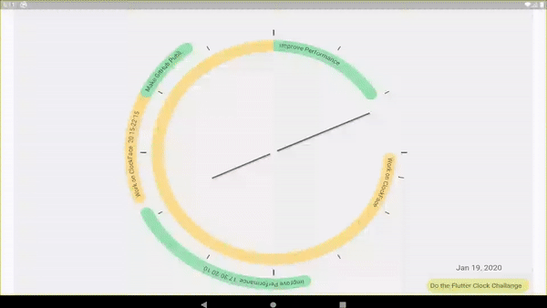

# Submission of [Flutter Clock Challenge](https://flutter.dev/clock#submissions) by [Sebastian Werner](https://github.com/tawalaya/) and [Andreas Salzmann](https://github.com/andi3/)

For the challenge we build an analog clock that also shows all calender events of the local device calender, so that you can always see what event comes next.

This Submission was tested on Android only.

### Demo Video:

### Screenshots:

.png)
.png)
.png)
.png)
.png)
